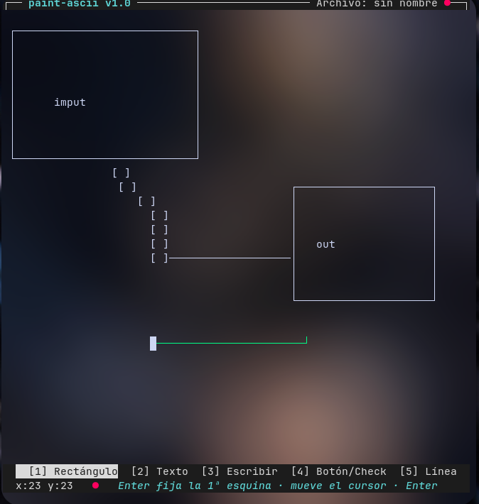

# paint-ascii

Editor de mockups TUI en la terminal inspirado en nano (Python + Textual).
Dibuja cajas, líneas y texto con caracteres de bordes y guarda el resultado
en un archivo `.txt` plano. Incluye un motor **JPG → ASCII** para dibujar
el mockup en un programa de pintura y convertirlo a texto.



## Requisitos

- Python 3.11+
- Textual: `pip install textual`
- Pillow (solo para el conversor): `pip install pillow`

Todo en uno: `pip install -r requirements.txt`

> ⚠️ **En Arch Linux** pip del sistema está bloqueado por **PEP 668**:
> los comandos `pip install ...` fallan. Usa **uv** en su lugar:
> `uv venv && uv pip install -r requirements.txt`, o instala todo el
> comando `paintui` con `uv tool install -e .` (ver más abajo).

## Uso (como nano/vim)

```bash
paintui [archivo.txt]          # con el comando instalado
python -m paint_ascii [archivo.txt]   # sin instalar
```

El archivo se guarda **en la carpeta donde invocas el comando** (igual que
nano/vim):

- `paintui grafica.txt` → abre o crea `grafica.txt` en la carpeta actual.
- `paintui ~/docs/plan.txt` → abre o crea el archivo en esa ruta.
- `paintui` (sin argumento) → lienzo en blanco; al pulsar `^O` pide el
  **nombre y la ruta**: solo un nombre guarda en la carpeta actual, y una
  ruta completa (p. ej. `~/docs/plan.txt`) guarda allí creando las
  subcarpetas si hace falta.

Instala el comando `paintui` en el sistema (opcional):

```bash
# Recomendado (entorno aislado, sin sudo; funciona en Arch con PEP 668)
uv tool install -e .

# Alternativa con pipx (requiere sudo para instalarlo en Arch)
sudo pacman -S python-pipx && pipx install .

# O sin instalar nada: script ejecutable que ya funciona desde cualquier carpeta
ln -s ~/Proyectos/paint-ascii/paintui ~/.local/bin/paintui
```

## Flujo alternativo: dibujar en un «paint» y convertir JPG → ASCII

Si te resulta más cómodo dibujar el mockup en un programa gráfico:

1. **Instala un paint de Linux** (todos guardan JPG):

   - **Pinta** (recomendado, estilo Paint.NET con capas):
     `sudo apt install pinta`
   - **KolourPaint** (clon de MS Paint): `sudo apt install kolourpaint`
   - **mtPaint** (ultraligero): `sudo apt install mtpaint`

2. **Dibuja el mockup** (fondo blanco, trazos gruesos dan mejor resultado)
   y guárdalo como JPG.

3. **Convierte a texto** (el `.txt` se guarda **junto a la imagen**, con el
   mismo nombre):

   ```bash
   python jpg2ascii.py mockup.jpg -w 100
   ```

   Resultado: `mockup.txt` en la misma carpeta. Si prefieres imprimir en
   consola usa `--print`, o elige otra ruta con `-o archivo.txt`.

4. **Retoca el resultado** en el editor:

   ```bash
   python -m paint_ascii mockup.txt
   ```

### Modos de conversión (`-m`)

| Modo     | Estilo                              | Ideal para                  |
|----------|-------------------------------------|-----------------------------|
| `classic`| Rampa de brillo ` .:-=+*#%@`        | Fotos y cualquier imagen    |
| `block`  | Bloques ` ░▒▓█`                     | Sombras y degradados        |
| `binary` | Alto contraste `#`/espacio          | Mockups limpios de línea    |
| `quad`   | Bloques 2×2 Unicode                 | Máxima fidelidad (con texto)| 
| `box`    | Caracteres de caja `─│┌┐└┘┼`        | Mockups con recuadros       |
| `mockup` | Recuadros + texto (OCR)             | **Copia casi exacta**       |

El modo **`mockup`** es el que buscas: detecta los recuadros de la imagen y
los dibuja perfectos con caracteres ASCII `+---` / `|` (como un mockup
clásico), y lee el texto con OCR (tesseract) para colocarlo legible en su
sitio, agrupado en líneas compactas. Requiere tener instalado:

```bash
sudo apt install tesseract-ocr        # motor OCR
sudo apt install tesseract-ocr-spa    # opcional, mejor español
```

Uso:

```bash
python jpg2ascii.py mockup.jpg -m mockup -w 100
# └─ usa cajas ASCII +--- ; añade --unicode para ┌─┐│└┘
```

Opciones: `-w` ancho en caracteres, `-i` invertir (fondos oscuros),
`-t` umbral 0-255, `-c` contraste, `-l` idioma del OCR (por defecto `eng`),
`-p`/`--print` imprimir en consola (en vez de guardar), `-o` guardar en
otra ruta.

> Consejo: JPG es con pérdida; si quieres bordes perfectos usa PNG
> (`python jpg2ascii.py mockup.png ...`).

## Herramientas (teclas 1-5)

| Tecla | Herramienta | Cómo funciona |
|-------|-------------|---------------|
| `1`   | Rectángulo  | `Enter` fija la 1ª esquina, mueve el cursor y `Enter` dibuja |
| `2`   | Texto       | `Enter` pide el texto y lo coloca plano en el cursor (sin marco) |
| `3`   | Escribir    | Escribe texto libre en el cursor |
| `4`   | Botón/Check | Escribe la etiqueta y `Enter` la coloca en `[ etiqueta ]` |
| `5`   | Línea       | `Enter` inicio, `Enter` fin (recta). `t` alterna `─│` / `═║` |

> Nota: con `[3] Escribir` o `[4] Botón/Check` activos, los dígitos `1-5`
> se teclean como texto (p. ej. «2FA»). Pulsa `Esc` para volver a `[1]`
> Rectángulo y luego usa `1-5` para cambiar de herramienta.

## Atajos

| Atajo        | Acción                                  |
|--------------|-----------------------------------------|
| `^O` / `^S`  | Guardar (pide nombre la primera vez)    |
| `^Q`         | Salir (pregunta si hay cambios)         |
| `^Z`         | Deshacer                                |
| `^Y`         | Rehacer                                 |
| `Esc`        | Cancelar operación en curso             |
| `F1`         | Ayuda                                   |
| Flechas      | Mover el cursor                         |
| Click        | Mover el cursor a la posición           |

## Probar

```bash
python -m unittest discover -s tests -v
```
